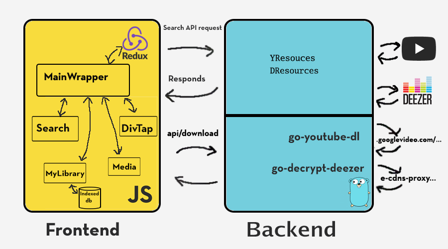

# YouDeez, the ultimate music streaming PWA

> YouDeez is an offline-first PWA that enables you to enjoy premium music for free without ads.

Visit the PWA on [https://moon004.github.io/YouDeez/](https://moon004.github.io/YouDeez/)

## Overview
YouDeez (Youtube + Deezer) allows you to download music/songs from both Youtube and Deezer (320kbps) library and cache it locally, and enjoy it even without internet connection.

Now you dont have to use Youtube converter to get the audio file anymore! Youdeez will serve the best audio quality of the video, this PWA is mobile supported, just visit [this link](https://moon004.github.io/YouDeez/) and the content will be cached locally. It is suggested that you ([add YouDeez to homescreen](https://www.howtogeek.com/196087/how-to-add-websites-to-the-home-screen-on-any-smartphone-or-tablet/))

***
## Build (For devs)
Before you proceed, make sure u have ([npm installed](https://www.npmjs.com/get-npm)).

Clone it to your local repo.
```sh
git clone https://github.com/moon004/YouDeez.git
```
Before anything else, make sure you have .env file at github.com/YouDeez/ , and it is filled with your youtube [Developer keys](https://developers.google.com/youtube/v3/getting-started) and [register your deezer account](https://www.deezer.com/register) details (inspect the code inside the handler/ files to get the key-value pair or u can change it), and also theres another .env file at fontend/app, that store the dns value (REACT_APP_*value).

### Backend (server) Setup
The backend depends on two CLIs to operate, [go-youtube-dl.exe](https://github.com/moon004/youtube-dl), [go-decrypt-dl.exe](https://github.com/moon004/Go-deezer-downloader), make sure u build the file with the correct name (Ex: **go build -o *go-youtube-dl.exe***). Put the built file into github.com/app/src/, and build the file, and execute the .exe file to spin up the backend. 

>Note: Always inspect the code, to get the idea of how it works

### Frontend setup
When you got that set, proceed to frontend/app and run:
```sh
npm install
```

When it's done, run **npm start** to start the development mode.

### Docker
Or You could build the docker image and run the container with the following:
```sh
docker build -t image-name -f Dockerfile .
docker run --rm -p 5050:5050 image-name
```

That's it,  happy tinkering!

***
## More About YouDeez
The backend was written in Golang with ([Go-chi](https://github.com/go-chi/chi)) router package. The frontend is powered by Javascript with React library, and redux library is used as state management.

A picture worth a thousand words.



All the Downloaded audio will be cached into [Indexed db](https://developer.mozilla.org/en-US/docs/Web/API/IndexedDB_API). The backend has been dockerized and hosted on [Amazon AWS EC2](https://aws.amazon.com/free/).

## Contribute to YouDeez
Any issues are welcome, if you are sending pull request, make sure to include test files, this project obeys the ([Airbnb coding style](https://github.com/airbnb/javascript)), well not entirely. Please do not hesitate to drop me a mail at herodotus94@gmail.com.